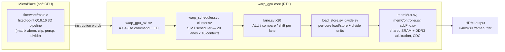

# warp-simd-fpga-gpu

A SIMT GPU built from scratch on an FPGA — custom 32-bit ISA, a
tile-based triangle rasterizer, a Rust assembler, and a MicroBlaze
host driver running a fixed-point 3D pipeline — targeting a
Xilinx Spartan-7 (`xc7s50csga324-1IL`).

  

  <a href="media/demo.mp4">Full-resolution video</a>

## What this is

Everything between "custom instruction encoding" and "pixels on the
screen" here is hand-built: the ISA, the assembler that targets it, the
RTL that executes it, and the host-side 3D pipeline that feeds it.
There's no soft-GPU IP, no HLS, no OpenGL — the firmware writes raw
32-bit instruction words into a command FIFO, and the FPGA fabric
schedules, executes, and rasterizes them across parallel SIMT lanes in
real time over HDMI.

## Architecture

- **20 SIMT lanes × 16 contexts**: each of the 20 parallel lanes
  round-robins across 16 hardware contexts (warps), so long-latency
  ops (loads, divides) hide behind other contexts instead of stalling
  the lane.
- **Predication instead of branching**: `skip_*` compare instructions
  disable a lane for the next N dynamic instructions based on a
  register compare, rather than taking a branch — keeps the scheduler
  simple and avoids divergent control flow.
- **Two memory spaces**: fast shared SRAM (`lw`/`sw`) for per-tile
  interpolants and small LUTs, and DDR3-backed global memory
  (`lwg`/`swg`) for the framebuffer and z-buffer, bridged through a
  clock-domain-crossing FIFO (`cdcFifo.sv`) between the GPU core clock
  and the memory-controller clock.
- **Host-driven rendering**: the MicroBlaze firmware does vertex
  transform, clipping, and perspective divide in Q16.16 fixed point,
  then hand-assembles a tile rasterizer program directly into GPU
  instruction words per triangle — no fixed-function triangle setup
  in hardware.

## ISA

32-bit fixed-width instructions, opcode always in bits `[31:28]`,
register file `r0`..`r15`. Full authoritative reference (with exact
bit layouts) lives in the assembler's
[header comment](fpga_assembler/src/main.rs); summary:

| Class | Mnemonics | Opcode | Notes |
|---|---|---|---|
| ALU | `add`, `sub` | `0000` | bit18 selects add/sub; bit19 = immediate flag |
| ALU | `and`, `or` | `0001` | bit18 selects and/or |
| ALU | `xor` | `0010` | |
| ALU | `mul` | `0011` | |
| ALU | `div` | `0100` | |
| Shift | `lsl`, `lsr`, `asr` | `0101` | shift amount ∈ {1,2,4,8,16,24} |
| Compare (imm) | `skip_lt/le/eq/ne/gt/ge` | `0110` | `CMPi`: disables the lane for N dynamic instructions |
| Compare (reg) | `skip_lt/le/eq/ne/gt/ge` | `0111` | `CMP`, register operand |
| Load | `lw` | `1000` | shared/SRAM: `rD <- M[rS1 + (rS2\|imm19)]` |
| Load | `lwg` | `1001` | global/DDR3 |
| Store | `sw` | `1010` | shared/SRAM, immediate offset, optional byte-enable |
| Store | `swg` | `1011` | global/DDR3 |
| Compare/set | `slt`, `slte` | `1100` | writes 1/0 to `rD` |
| CPU store | `cpu_store` | `1101` | host CPU injects a data block directly into shared memory |
| Barrier | `barrier` | `1111` | memory sync + context-count reprogramming |
| Data | `.data`, `.word` | — | raw word emit, assembler directive |

## Layout

- [`fpga_assembler/`](fpga_assembler) — Rust assembler for the ISA
  above. Test programs in `fpga_assembler/src/*.s` implement the tile
  rasterizer, framebuffer clear, and sRGB LUT setup.
- [`firmware/`](firmware) — MicroBlaze host driver: clock
  reconfiguration, LUT/framebuffer uploads, and the fixed-point 3D
  pipeline that emits GPU instructions per triangle.
- [`rtl/`](rtl) — GPU core RTL: SIMT cluster/scheduler, lanes, register
  files, load/store and divide units, AXI4-Lite integration, memory
  arbitration, and board-level top. See [`rtl/README.md`](rtl/README.md)
  for the full file-by-file breakdown.
- [`hw/`](hw) — Vivado hardware handoff (`.xsa`) and pin/timing
  constraints (`.xdc`) for the target board.
- [`media/`](media) — demo capture.

## Status

Software rasterizer pipeline, assembler, and GPU core RTL are working
end-to-end over a command FIFO on hardware — the demo above is a live
capture, not a simulation.
