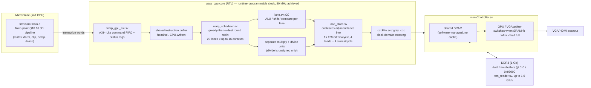

# warp-simd-fpga-gpu

A SIMT GPU built from scratch on an FPGA: custom 32-bit ISA, a
tile-based triangle rasterizer, a Rust assembler, and a MicroBlaze
host driver running a fixed-point 3D pipeline, targeting a
Xilinx Spartan-7 (`xc7s50csga324-1IL`).

  

  <a href="media/demo.mp4">Full-resolution video</a>

## What this is

Everything between "custom instruction encoding" and "pixels on the
screen" here is hand-built: the ISA, the assembler that targets it, the
RTL that executes it, and the host-side 3D pipeline that feeds it.
There's no soft-GPU IP, no HLS, no OpenGL — the firmware writes raw
32-bit instruction words into a command FIFO, and the FPGA fabric
schedules, executes, and rasterizes them across parallel SIMT lanes in
real time over HDMI.

## Architecture

- **20 SIMT lanes × up to 16 hardware contexts (warps)**: 20 lanes was
  chosen because it cleanly lets the rasterizer fill the screen's x-axis
  in two iterations. Each lane/context pair has 16 addressable
  registers; `r15` is hardwired to that lane's thread ID rather than
  being general-purpose.
- **Everything is integer math** — there wasn't room in the design for
  floating-point units, so the host firmware does all vertex/matrix
  math in Q16.16 fixed point before handing triangles to the GPU.
- **Predication instead of branching**: `skip_*` compare instructions
  disable a lane for the next N dynamic instructions based on a
  register compare, rather than taking a branch.
- **Scheduler**: round-robin across contexts with one-cycle lookahead —
  it checks whether the next context can actually issue next cycle,
  and if not, skips ahead two contexts rather than stalling on it.
  Issue policy is greedy-then-oldest: a context keeps issuing ALU
  instructions back-to-back for as long as it can before yielding.
  This spreads contexts out to different points in the shared
  instruction buffer, which in practice keeps a variety of operand/
  instruction types available to the scheduler on any given cycle —
  keeping the ALU, multiply/divide, and load/store pipelines full.
- **Shared instruction buffer**: a single CPU-writable buffer with a
  head and tail, read by 16 independent per-context program counters.
  The tail advances when MicroBlaze writes new instructions; the head
  advances only once every context's PC has moved past that slot.
- **Context count is runtime-configurable**, 1 to 16, via `barrier`
  instructions — `barrier` does double duty as both a full GPU
  memory/execution sync point and the mechanism for reprogramming how
  many contexts are active.
- **Memory coalescing**: adjacent lanes' loads/stores are grouped into
  a single 128-bit transaction, one per cycle, rather than one
  transaction per lane. The load/store units can each sustain 4
  loads/stores per cycle, with 2 loads or stores in flight inside the
  GPU core itself and substantially more in flight further down the
  pipeline (memory controller, CDC, MIG).
- **Two memory spaces**: shared SRAM (`lw`/`sw`) and DDR3-backed global
  memory (`lwg`/`swg`), bridged through a clock-domain-crossing FIFO
  (`cdcFifo.sv`) between the GPU core clock and the memory-controller
  clock. The GPU core's clock is runtime-programmable via the CDC
  boundary — reconfigured live over the `clk_wiz` DRP interface (see
  `reconfig_clk()` in `firmware/main.c`); 80 MHz achieved on hardware.
- **No cache** — shared SRAM is used as a software-managed cache
  instead, and DDR3 latency (tens of cycles) is low enough relative to
  a discrete GPU's memory hierarchy that a hardware cache wasn't worth
  the area.
- **Display**: the memory controller multiplexes DDR3 access between
  the GPU and the VGA/HDMI controller, switching dynamically based on
  the fill level of an SRAM framebuffer buffer (up to 2048 pixels) —
  it switches over once that buffer drops below half full. A dual
  framebuffer in DDR3 (base addresses `0x0` and `0x96000`) eliminates
  tearing. DDR3 capacity is 1 Gb; `ram_reader.sv` sustains up to
  1.6 GB/s of traffic, MIG-permitting.
- **Host-driven rendering**: the MicroBlaze firmware does vertex
  transform, clipping, and perspective divide in Q16.16 fixed point,
  then hand-assembles a tile rasterizer program directly into GPU
  instruction words per triangle — no fixed-function triangle setup
  in hardware.

### AXI4-Lite status registers

| Register | Meaning |
|---|---|
| 0 | Instruction buffer (ibuf) fill level |
| 1 | Number of pending CPU writes not yet retired into shared memory |
| 2 | Currently-displayed framebuffer index, packed with the current `drawX`/`drawY` scan position |

## ISA

32-bit fixed-width instructions, opcode always in bits `[31:28]`,
register file `r0`..`r15`. Full authoritative reference (with exact
bit layouts) lives in the assembler's
[header comment](fpga_assembler/src/main.rs); summary:

| Class | Mnemonics | Opcode | Notes |
|---|---|---|---|
| ALU | `add`, `sub` | `0000` | bit18 selects add/sub; bit19 = immediate flag |
| ALU | `and`, `or` | `0001` | bit18 selects and/or |
| ALU | `xor` | `0010` | |
| Multiply | `mul` | `0011` | separate execution unit from the ALU |
| Divide | `div` | `0100` | separate execution unit from the ALU; unsigned only |
| Shift | `lsl`, `lsr`, `asr` | `0101` | shift amount ∈ {1,2,4,8,16,24} |
| Compare (imm) | `skip_lt/le/eq/ne/gt/ge` | `0110` | `CMPi`: disables the lane for N dynamic instructions |
| Compare (reg) | `skip_lt/le/eq/ne/gt/ge` | `0111` | `CMP`, register operand |
| Load | `lw` | `1000` | shared/SRAM: `rD <- M[rS1 + (rS2\|imm19)]` |
| Load | `lwg` | `1001` | global/DDR3 |
| Store | `sw` | `1010` | shared/SRAM, immediate offset, optional byte-enable |
| Store | `swg` | `1011` | global/DDR3 |
| Compare/set | `slt`, `slte` | `1100` | writes 1/0 to `rD` |
| CPU store | `cpu_store` | `1101` | host CPU injects a data block directly into shared memory |
| Barrier | `barrier` | `1111` | memory sync + context-count reprogramming |
| Data | `.data`, `.word` | — | raw word emit, assembler directive |

## Layout

- [`fpga_assembler/`](fpga_assembler) — Rust assembler for the ISA
  above. Test programs in `fpga_assembler/src/*.s` implement the tile
  rasterizer, framebuffer clear, and sRGB LUT setup.
- [`firmware/`](firmware) — MicroBlaze host driver: clock
  reconfiguration, LUT/framebuffer uploads, and the fixed-point 3D
  pipeline that emits GPU instructions per triangle.
- [`rtl/`](rtl) — GPU core RTL: SIMT cluster/scheduler, lanes, register
  files, load/store and divide units, AXI4-Lite integration, memory
  arbitration, and board-level top. See [`rtl/README.md`](rtl/README.md)
  for the full file-by-file breakdown.
- [`hw/`](hw) — Vivado hardware handoff (`.xsa`) and pin/timing
  constraints (`.xdc`) for the target board.
- [`media/`](media) — demo capture.

## Status

Software rasterizer pipeline, assembler, and GPU core RTL are working
end-to-end over a command FIFO on hardware — the demo above is a live
capture, not a simulation.
